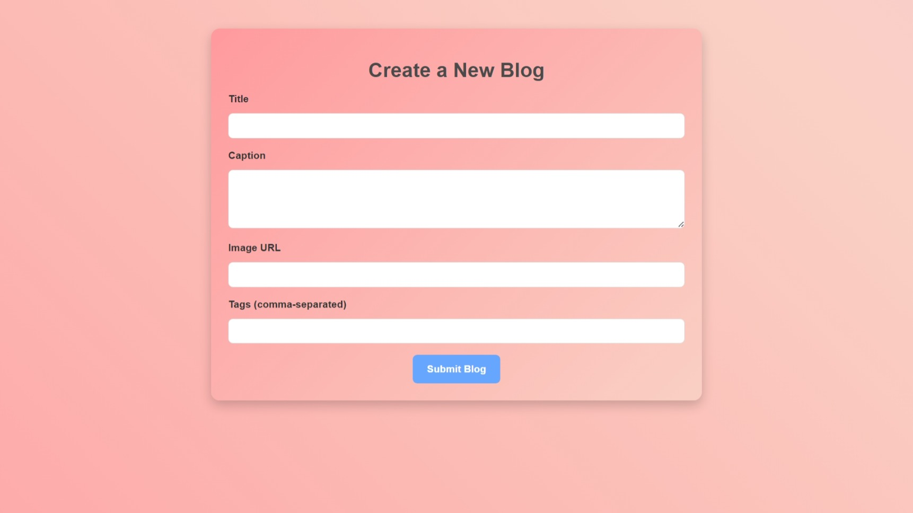
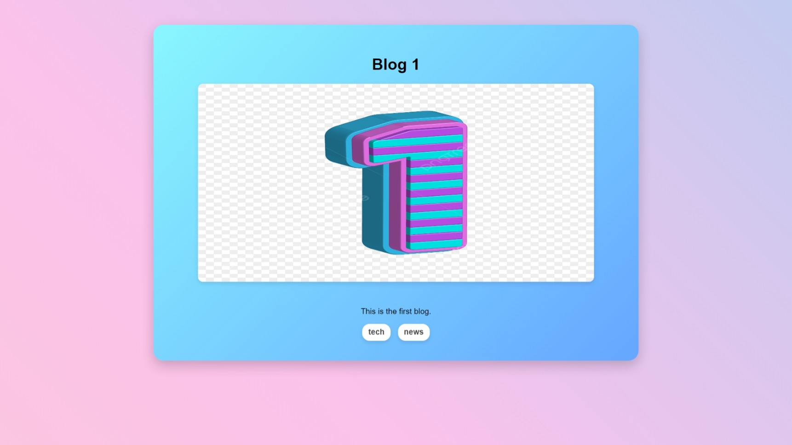

# Blog Posts

## 1. Task Description

The task is to create a **Blog Posts** that allows users to manage blog entries effectively. The application includes a feature to display multiple blog posts in a card-based layout, with each card showing a title and caption. It also includes functionality to display a detailed view of a single blog post when clicked. The layout is responsive, ensuring compatibility across various screen sizes and devices for an optimal user experience.

---

## 2. Task Output Screenshot

1. **Blog Cards Layout**:  
   Displays multiple blog entries in a grid format. Each card contains a blog title and a short caption, with a "Read More" button to view details.

2. **Single Blog View**:  
   Displays the detailed view of a selected blog post, including its title, full image, and detailed caption or content.

3. **Create Blog Page**:  
   

---

## 3. Widget/Algorithm Used In Task

- **Grid-Based Blog Listing**:  
  A grid layout is used to display blog entries as cards. Each card includes:
  - Blog title
  - Short caption
  - A "Read More" button that navigates to the detailed view.

- **Dynamic Blog Cards (React Components)**:  
  Blog posts are dynamically rendered using React components. Data for blogs is passed as props, enabling reusability and scalability of components.

- **Single Blog View (React Routing)**:  
  When a "Read More" button is clicked, the app dynamically routes to a detailed view of the selected blog post. This is achieved using React Router for smooth navigation.

- **Responsive Design (CSS Flexbox and Media Queries)**:  
  The layout adjusts based on screen size:
  - Grid for desktops and tablets
  - Stacked layout for smaller screens (mobile-friendly)

- **Dynamic Styling with CSS Animations**:  
  Hover animations on cards and buttons enhance interactivity. Gradient backgrounds and shadows improve the visual appeal.

- **State Management (React useState/useEffect)**:  
  Used to store and update the list of blog posts and the currently selected blog for detailed viewing. Dynamic updates are reflected instantly without page reloads.

- **Data Representation in JSON**:  
  Blog posts are represented as a JSON array, allowing easy addition, removal, and manipulation of posts programmatically.

---
